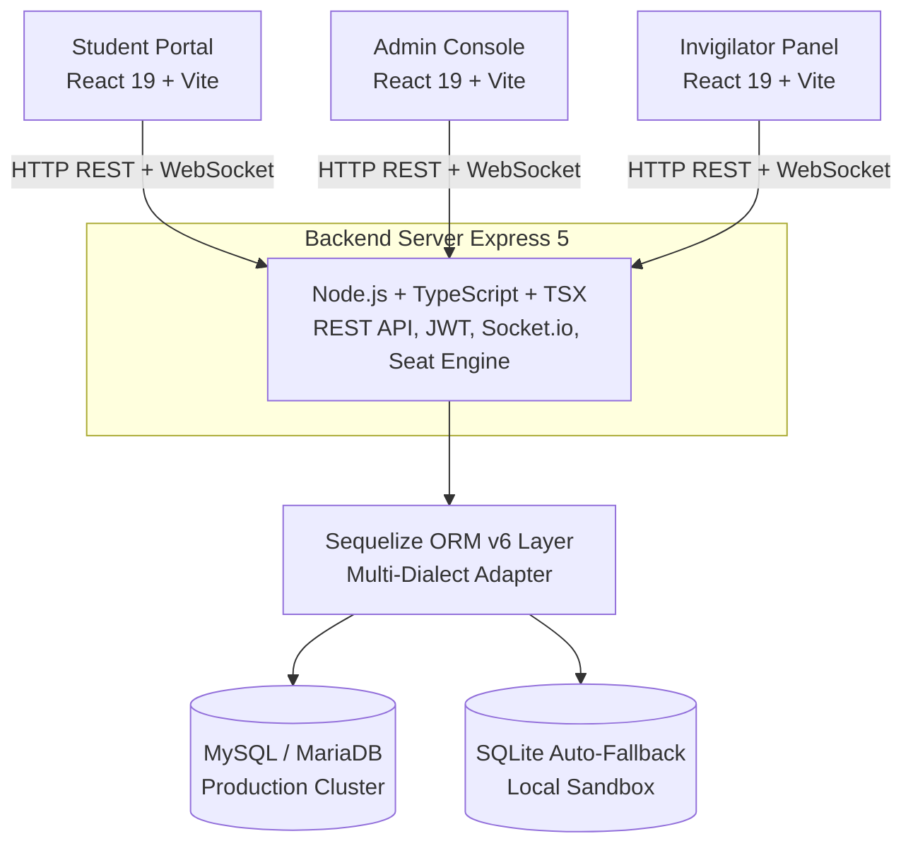
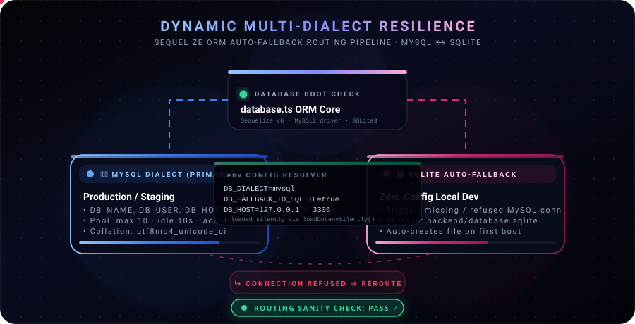

<div align="center">

<!-- ANIMATED HEADER BANNER -->


# SEAT-SYNC

### Smart Academic Seating & Examination Integrity Management System


<br/>

**[ [System Overview](#-system-overview) • [Problem Statement](#-problem-statement) • [Proposed Solution](#-proposed-solution) • [Architecture](#-system-architecture) • [Tech Stack](#-technology-stack) • [Database](#-database-architecture) • [Setup Guide](#-installation--setup-guide) ]**

</div>

---

## 📋 Table of Contents

| # | Section | Description |
|:---:|:---|:---|
| 01 | [System Overview](#-system-overview) | What Seat-Sync is and its core purpose |
| 02 | [Problem Statement](#-problem-statement) | Limitations of current manual seating processes |
| 03 | [Proposed Solution](#-proposed-solution) | How Seat-Sync solves those problems |
| 04 | [Core Features](#-core-features) | Full feature breakdown |
| 05 | [System Architecture](#-system-architecture) | Architecture diagram and module layout |
| 06 | [Technology Stack](#-technology-stack) | All libraries, frameworks, and tools used |
| 07 | [Database Architecture](#-database-architecture) | MySQL & SQLite fallback engine |
| 08 | [Interactive Visualizer](#-interactive-seating-engine-visualizer) | Animated algorithm storyboard |
| 09 | [Installation & Setup Guide](#-installation--setup-guide) | Step-by-step local setup |
| 10 | [Project Structure](#-project-structure) | Directory and file layout |

---

## 🏛️ System Overview

> **Seat-Sync** is an enterprise-grade, web-based **Academic Seating and Examination Integrity Management System** designed to fully automate the process of generating, distributing, and managing exam hall seating plans for educational institutions.

Seat-Sync serves as a unified platform for **three distinct user roles** — Administrators, Invigilators, and Students — providing each role with a dedicated portal tailored to their responsibilities. The system enforces a strict, mathematically-verified anti-cheating seating protocol that guarantees no two students from the same department sit adjacent to each other on any shared bench.

### Examination Modules

| Module | Scope | Description |
|:---|:---|:---|
| **University End-Semester Module** | Campus-wide | Handles large-scale end-of-semester seating across multiple halls simultaneously |
| **Internal Series Module** | Department-level | Manages internal midterm and series examination seating with subject interleaving |

---

## ⚠️ Problem Statement

### Existing System

The existing system in most educational institutions relies on a **fully manual, spreadsheet-based approach** to exam hall seating. Administrative staff use Microsoft Excel or Google Sheets to manually type student names, assign roll numbers to room slots, and print physical notice boards for seat display.

### Critical Limitations

| Limitation | Impact |
|:---|:---|
| **No Anti-Cheating Enforcement** | Students of the same department are frequently seated adjacent to one another, enabling exam fraud. |
| **High Administrative Overhead** | Generating seating for 1,000+ students takes hours of manual Excel formatting and error checking. |
| **No Real-Time Notification** | Students must physically visit campus bulletin boards to locate their seat numbers. |
| **Error-Prone & Inconsistent** | Manual data entry leads to duplicate seat assignments, missing entries, and hall overflows. |
| **No Database Integration** | Excel files have no referential integrity; audit trails and historical records are lost easily. |
| **No Digital Portal** | Students have no centralized dashboard to view their seat, exam schedule, or hall details. |

---

## ✅ Proposed Solution

### Seat-Sync System

**Seat-Sync** is a proposed **automated, algorithm-driven examination seating management platform** that replaces the manual Excel-based approach with an intelligent, web-accessible system backed by a structured relational database, a REST API server, and real-time WebSocket notifications.

### How Seat-Sync Solves Every Problem

| # | Existing Problem | Seat-Sync Solution |
|:---:|:---|:---|
| 01 | Students from the same department sit together | **Dual-Pool Interleaving Algorithm** guarantees every bench-pair has students from different departments |
| 02 | Hours of manual Excel work per exam | **One-click automated generation** completes full hall allocation in under **800 milliseconds** |
| 03 | Students queue at physical notice boards | **Real-time Socket.io push notifications** deliver seat details directly to student dashboards |
| 04 | Duplicate and missing seat assignments | **Sequelize ORM with referential integrity** ensures every seat is uniquely assigned and validated |
| 05 | No audit trail or historical records | **Persistent relational database** maintains full allocation history, invigilator logs, and audit records |
| 06 | No student self-service portal | **Dedicated Student Portal** shows personalized seat, hall, room, and exam schedule information |

> [!NOTE]
> The proposed system maintains a strict **mathematical anti-collusion constraint**: for any bench pair in any row, `Department(Seat_Left) ≠ Department(Seat_Right)` — enforced programmatically for every seat generated.

---

## 🎯 Core Features

### Feature Matrix

| Administrator Portal | Student & Invigilator Portals |
|:---|:---|
| ✔️ Room & Hall Configuration | ✔️ Real-time Seat Notification |
| ✔️ Roster Upload (Excel / DOCX) | ✔️ Personalized Seat Dashboard |
| ✔️ One-Click Seat Generation | ✔️ Invigilator Room Assignment View |
| ✔️ Anti-Collusion Enforcement | ✔️ Exam Schedule Display |
| ✔️ PDF Seating Chart Export | ✔️ Mobile-Responsive Interface |
| ✔️ Invigilator Assignment | ✔️ Socket.io Live Updates |
| ✔️ Analytics Dashboard | ✔️ Secure JWT Authentication |
| ✔️ MySQL ↔ SQLite Auto-Fallback | ✔️ Swagger API Documentation |

---

## 🗂️ System Architecture

### Ecosystem Architecture



### Seat Allocation Modules

| University End-Semester Module | Internal Series Module |
|:---|:---|
| • Physical Row-Bench Diff Engine<br>• Roster Sequence Mapper<br>• Active/Inactive Seat Preserve<br>• Hall Capacity Equation Solver | • Dual-Pool Balancing System<br>• Subject Interleaving Logic<br>• Alphanumeric Continuity Sort<br>• Column-Continuous Assignment |

---

## 🛠️ Technology Stack

### Client-Side (Frontend)

| Technology | Version | Purpose |
|:---|:---:|:---|
| **React** | `19.x` | Core UI framework with server component support |
| **TypeScript** | `5.x` | Type-safe application logic |
| **Vite** | `5.x` | Ultra-fast development build pipeline |
| **HeroUI** | Latest | Accessible, animated UI component system |
| **Redux Toolkit** | `2.x` | Centralized global state management |
| **Framer Motion** | `11.x` | Declarative page and component animations |
| **Lottie React** | Latest | High-fidelity vector animation rendering |
| **Recharts** | `2.x` | Analytics charts and dashboard visualizations |
| **jsPDF + AutoTable** | Latest | PDF seating chart generation and export |
| **Vanta.js** | Latest | Interactive WebGL canvas backgrounds |

### Server-Side (Backend)

| Technology | Version | Purpose |
|:---|:---:|:---|
| **Node.js** | `18.x+` | JavaScript server runtime environment |
| **Express** | `5.x` | HTTP server framework and REST API routing |
| **TypeScript** | `5.x` | Type-safe backend development |
| **Sequelize ORM** | `6.x` | Multi-dialect relational database abstraction layer |
| **MySQL2** | Latest | Primary production database driver |
| **SQLite3** | Latest | Local development auto-fallback database driver |
| **Socket.io** | `4.x` | Bidirectional real-time WebSocket communication |
| **JWT (jsonwebtoken)** | Latest | Secure stateless user session authentication |
| **Swagger UI Express** | Latest | Interactive REST API documentation at `/api-docs` |
| **xlsx** | Latest | Excel (.xlsx) roster file parsing and ingestion |
| **mammoth** | Latest | Microsoft Word (.docx) document text extraction |
| **pdf-parse** | Latest | PDF document data extraction |
| **tesseract.js** | Latest | OCR-based image and scanned document text extraction |
| **bcryptjs** | Latest | Secure password hashing and verification |
| **multer** | Latest | Multipart form file upload handler |

---

## 🗄️ Database Architecture

<div align="center">



</div>

Seat-Sync uses **Sequelize ORM** with a custom multi-dialect routing layer that automatically selects the appropriate database engine based on the server's environment configuration.

### Database Comparison

| Parameter | 🐬 MySQL / MariaDB | 🗃️ SQLite |
|:---|:---|:---|
| **Role** | Primary production database | Auto-fallback for local development |
| **Connection** | TCP/IP at `host:3306` | Local file — `database.sqlite` |
| **Setup Required** | Yes — MySQL server must be installed | No — auto-created on first server boot |
| **Character Set** | `utf8mb4_unicode_ci` | Default binary encoding |
| **Connection Pooling** | `max: 10`, idle: `10s`, acquire: `30s` | Direct file transaction lock |
| **Best For** | Staging, production, multi-user environments | Local development, CI/CD testing |

### Environment Configuration

**For Local Development (SQLite — Zero Config):**

```env
PORT=5000
NODE_ENV=development
JWT_SECRET=your_jwt_secret_key_here
DB_FALLBACK_TO_SQLITE=true
```

**For Production / Staging (MySQL):**

```env
PORT=5000
NODE_ENV=production
JWT_SECRET=your_jwt_secret_key_here
DB_DIALECT=mysql
DB_HOST=127.0.0.1
DB_PORT=3306
DB_NAME=seatsyncdb
DB_USER=root
DB_PASS=your_database_password
DB_FALLBACK_TO_SQLITE=true
```

> [!TIP]
> Setting `DB_FALLBACK_TO_SQLITE=true` alongside MySQL credentials enables **graceful degradation** — the server will automatically fall back to SQLite if MySQL is unreachable, making it ideal for hybrid developer environments.

---

## 🎮 Interactive Seating Engine Visualizer

The seating algorithm is brought to life in a self-contained, fully offline **Interactive Visual Storyteller** — a browser-based cartoon-style simulation of the entire matchmaking process.

| Feature | Description |
|:---|:---|
| 🎓 **Dual Pool Visualizer** | Watch CS & ME students split into Left/Right queues in real-time |
| 🪑 **Step-by-Step Allocator** | Place students column-by-column with Bezier particle trajectories |
| 🛡️ **Anti-Collision Laser Shield** | Filled bench pairs activate a neon shield showing zero-collision |
| 🎛️ **Web Audio Synthesizer** | Customizable waveform sound cues (Sine, Triangle, Square, Sawtooth) |
| 🗄️ **DB Fallback Simulator** | Toggle MySQL Healthy / MySQL Refused → watch SQLite activate |
| 📊 **Live Telemetry Dashboard** | Real-time pool counters, balance score, and allocation speed metric |

**To launch:**
> Double-click `visual_storyteller.html` — works completely offline with no internet or CDN dependency.

---

## 🚀 Installation & Setup Guide

### Prerequisites

Ensure the following are installed on your machine before proceeding:

| Requirement | Minimum Version | Purpose |
|:---|:---:|:---|
| **Node.js** | `18.x` or above | JavaScript server runtime |
| **npm** | `9.x` or above | Package manager |
| **MySQL** *(optional)* | `8.x` or above | Primary database *(SQLite fallback available)* |

### Phase 1 — Backend Setup

**Step 1.** Navigate to the backend directory:
```bash
cd backend
```

**Step 2.** Install all server dependencies:
```bash
npm install
```

**Step 3.** Create the environment configuration file.
Create a new file named `.env` inside the `backend/` folder:

```env
# ─── Quick Start (SQLite — No Database Required) ───────────────────────────
PORT=5000
NODE_ENV=development
JWT_SECRET=supersecretkey_change_in_production
DB_FALLBACK_TO_SQLITE=true

# ─── Production Grade (MySQL — Uncomment and fill below) ───────────────────
# DB_DIALECT=mysql
# DB_HOST=127.0.0.1
# DB_PORT=3306
# DB_NAME=seatsyncdb
# DB_USER=root
# DB_PASS=your_password_here
# DB_FALLBACK_TO_SQLITE=true
```

**Step 4.** Start the backend development server:
```bash
npm run dev
```

| Endpoint | URL |
|:---|:---|
| **API Server** | `http://localhost:5000` |
| **Swagger API Docs** | `http://localhost:5000/api-docs` |

### Phase 2 — Frontend Setup

**Step 1.** Navigate to the frontend directory:
```bash
cd ../frontend
```

**Step 2.** Install all client dependencies:
```bash
npm install
```

**Step 3.** Create the frontend environment file:
```env
VITE_API_URL=http://localhost:5000/api
```

**Step 4.** Start the Vite development server:
```bash
npm run dev
```

| Portal | URL |
|:---|:---|
| **Application** | `http://localhost:5173` |

---

## 📁 Project Structure

```text
Seat-Sync/
├── backend/                         ← Node.js + Express 5 Server
│   ├── src/
│   │   ├── config/
│   │   │   └── database.ts          ← Sequelize multi-dialect ORM initializer
│   │   ├── controllers/             ← Request handler logic per module
│   │   ├── models/                  ← Sequelize table models and associations
│   │   ├── routes/                  ← Express API route definitions
│   │   ├── middleware/              ← JWT authentication, upload handlers
│   │   └── utils/                   ← Allocation engine, document parsers
│   ├── .env                         ← Environment configuration (gitignored)
│   ├── database.sqlite              ← Auto-created SQLite fallback database
│   └── package.json
│
├── frontend/                        ← React 19 + Vite Client Application
│   ├── src/
│   │   ├── pages/                   ← Admin, Student, Invigilator page views
│   │   ├── components/              ← Reusable HeroUI + custom components
│   │   ├── store/                   ← Redux state slices and selectors
│   │   ├── hooks/                   ← Custom React hooks
│   │   └── api/                     ← Axios API service layer
│   ├── .env                         ← Frontend environment variables
│   └── package.json
│
├── README.md                        ← Project documentation (this file)
├── seating_visualization.md         ← Mathematical algorithm specification
├── seating_animation.svg            ← SMIL animated seating engine diagram
├── database_sync_animation.svg      ← SMIL animated DB fallback diagram
└── visual_storyteller.html          ← Interactive offline browser visualizer
```

---

## 📐 Algorithm Reference

For the complete mathematical specification of the seating algorithm — including formal LaTeX equations, the dual-pool splitting protocol, anti-collusion constraint proofs, and the soft-diff database lifecycle — refer to the dedicated technical document:

> 📄 **[seating_visualization.md](./seating_visualization.md)** — Seating Algorithms & Mathematical Specification

---

<div align="center">


<br/>

*Developed with precision for perfect examination integrity and seamless campus experiences.*

**Seat-Sync — Arranging Success, Bench by Bench.**

<br/>


</div>
